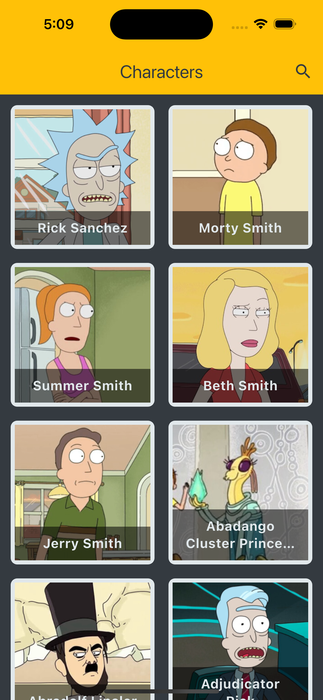
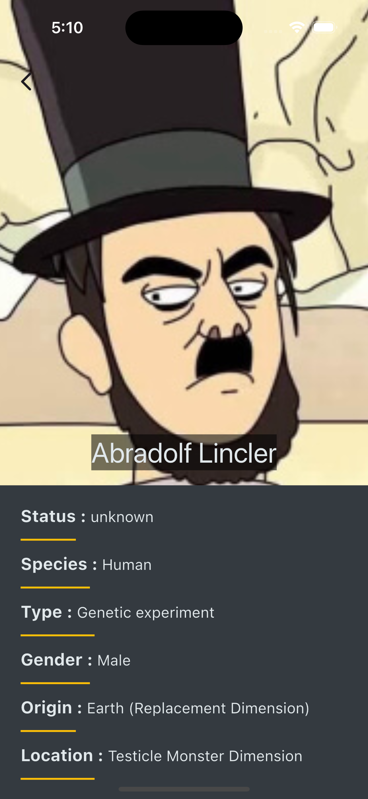
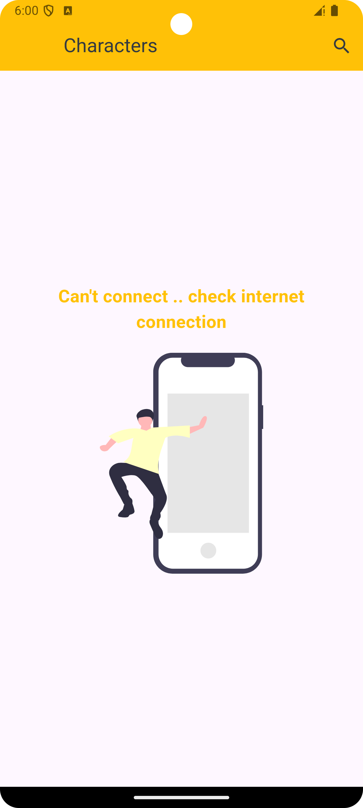

# **Rick and Morty App**

🚀 A Flutter app for practicing clean architecture and state management using Cubit.

## 📌 Overview

This app follows a clean architecture approach, separating data, business logic, and presentation layers.
It utilizes the Rick and Morty API to fetch and display character data, supports offline storage, and features smooth Flutter animations.

## 🏗 Architecture Used

This app follows a Clean Architecture pattern:

### 1️⃣ Data Layer 🗄️

Model: Represents data structures.
API Service: Fetches data using Dio.
Repository: Acts as an abstraction between data sources and business logic.
### 2️⃣ Business Logic Layer ⚙️

Uses Cubit (from flutter_bloc) to manage state and interact with the repository.
### 3️⃣ Presentation Layer 🎨

## 📂 Project Directory Structure

```plaintext
lib/
│── business_logic/        
│   ├── cubit/            
│   │   ├── character_cubit.dart
│   │   ├── character_states.dart
│
│── data/                 
│   ├── apiServices/       
│   │   ├── api_services.dart
│   ├── models/           
│   │   ├── character_model.dart
│   ├── repository/        
│   │   ├── characters_repo.dart
│
│── helper/                
│   ├── app_strings.dart
│   ├── color_manager.dart
│
│── presentation/          
│   ├── screens/           
│   │   ├── homeScreen/
│   │   ├── character_details_screen.dart
│   ├── widgets/           
│
│── router/                
│── main.dart              
```

## 🚀 Features

✅ Fetch Data from API (Using Dio)
✅ State Management (Cubit)
✅ Flutter Offline (Connect to internet)
✅ Animations (Flutter Animation Package)
✅ SliverList & CustomScrollView for smooth scrolling
✅ Search & Filter Characters
✅ Dark Mode Support

## 📸 Screenshots

| Home Page | Character Details | Offline Page |
|-----------|------------------|--------------|
|  |  |  |


*Technology	Usage
Flutter 🖥️	UI Development
Dio 🌐	API Requests
Bloc/Cubit 🔄	State Management
Flutter Animation 🎬	Smooth UI Transitions
📸 Screenshots*

Home Page	Character Details

## 🛠 Future Enhancements

🔹 Unit Testing & Widget Testing


*That’s it! This README.md is now GitHub-ready 🚀. Let me know if i can make any modifications! 🎯*
